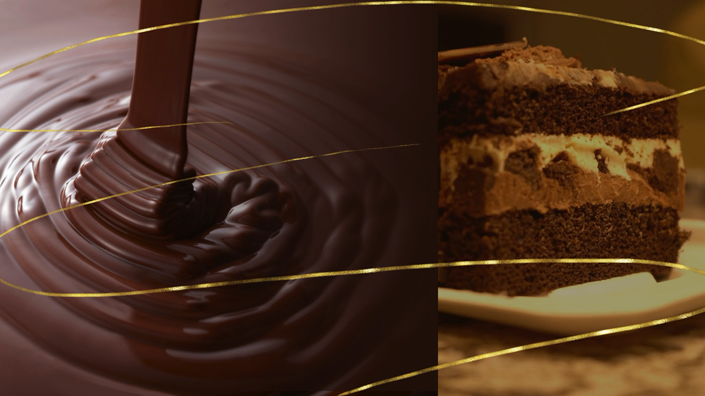

# Chocolatier Bakery Restaurant Website Template



This project is a front-end-only restaurant website template for a fictional bakery called **Chocolatier Bakery**.

It is designed as a polished starter template for a restaurant, cafe, bakery, or dessert shop website. Visitors can browse featured items, add menu items to a cart, open an order form, review their order, and see an order confirmation.

This template is best used by developers looking for front-end restaurant website design ideas, layout inspiration, or a starting point for building a restaurant-themed UI.

Checkout the Figma Template that I created here: [Chocolatier Bakery Figma Template](https://www.figma.com/community/file/1635437306999238727)

Checkout the Demo Video here: [Chocolatier Bakery Demo Video](https://youtu.be/1wHEGT5m0FQ)

## What This Template Does

- Shows a restaurant-style landing page
- Displays a hero section with video
- Includes a responsive navigation menu
- Uses a hamburger menu on smaller screens
- Displays featured "most ordered" items
- Displays a 10-item menu
- Lets customers add menu items to a cart
- Tracks item quantities in the cart
- Shows a top notification when an item is added to the cart
- Lets customers jump directly to the cart from the notification
- Lets customers dismiss the cart notification by button, timeout, or swipe
- Blocks cart additions that would reach 12 or more items
- Opens an order form modal
- Prefills the order form from the cart
- Keeps the cart and "Order now" buttons in sync
- Supports multiple order items with individual quantities
- Validates customer details
- Prevents past pickup dates
- Limits pickup dates to one week ahead
- Requires customers to call for orders of 12 or more items
- Shows an order review step before placing the order
- Shows a final "Your order is placed!" confirmation
- Includes a floating "Back to top" button
- Includes hover and focus styling for navigation, menu cards, buttons, cart rows, and controls
- Includes keyboard support for adding items to the cart with Enter

## Accessibility And Interaction Features

This template includes several accessibility-minded interaction details:

- skip link for keyboard users
- semantic page landmarks
- accessible form labels
- responsive hamburger menu with `aria-expanded`
- modal dialogs with focus trapping
- focus return after modal actions
- keyboard-friendly cart and order controls
- status notifications using `aria-live`
- visible focus states
- hover and focus styles that mirror each other where possible

This is still a template, so accessibility should be tested again after customizing colors, images, content, and behavior.

## Important Scope Note

This project is **front end only**.

There is no backend, database, payment processing, email sending, order storage, admin dashboard, or real restaurant integration. The order flow is only a front-end template interaction.

## Limitations

- No payment feature is included.
- No backend is included.
- Orders are not saved anywhere.
- Customers do not receive confirmation emails.
- Restaurant staff do not receive submitted orders.
- Cart data resets when the page is refreshed.
- This is only a template for a restaurant website, not a production ordering system.

## Project Files

```text
formsJS/
├── index.html              # Main page markup
├── README.md               # Project documentation
├── assets/
│   ├── chocolatier.mp4     # Background video
│   └── ChocolatierCTA.mp4  # Hero video
├── css/
│   ├── global.css          # Base/reset styles
│   └── design.css          # Restaurant template styling
└── js/
    ├── form.js             # Cart, validation, and order flow
    └── modalWindow.js      # Modal and mobile menu behavior
```

## How To Use

Open `index.html` in a browser.

No build step is required. No package installation is required. This template uses plain HTML, CSS, and JavaScript.

## Dependencies

There are no external package dependencies.

You only need:

- a modern web browser
- a code editor, such as VS Code

## How To Edit

To change the restaurant name:

- edit the text in `index.html`
- search for `Chocolatier Bakery`
- replace it with your restaurant name

To change menu items:

- edit the menu cards in `index.html`
- update item names, descriptions, prices, and image URLs
- update the matching `<option>` items inside the order form

To change colors, spacing, layout, or visual style:

- edit `css/design.css`

To change global reset/base styles:

- edit `css/global.css`

To change cart, validation, or order behavior:

- edit `js/form.js`
- this includes cart totals, order limits, toast notifications, order review, and confirmation behavior

To change modal or hamburger menu behavior:

- edit `js/modalWindow.js`
- this includes modal open/close behavior, mobile navigation, and focus trapping

## How To Fork And Customize

1. Fork the repository.
2. Clone your fork to your computer.
3. Open the project in your code editor.
4. Navigate to `01_JS/formsJS`.
5. Open `index.html` in your browser.
6. Edit the restaurant name, menu items, images, colors, and copy.
7. Test the cart and order form in the browser.
8. Commit and push your changes to your fork.

## Image Disclaimer

Some menu images are pulled from Unsplash using remote image links.

If you use this template for a real project, review the image license and replace the placeholder images with your own restaurant photos or approved production assets.

## Production Notes

Before using this for a real restaurant, you would need to add:

- backend order handling
- secure payment processing
- order storage
- email or SMS confirmations
- restaurant/admin notifications
- real menu availability
- privacy policy and terms
- accessibility and browser testing
- production hosting

This template is best used as a learning project, prototype, front-end design reference, or visual starting point for restaurant website projects.
